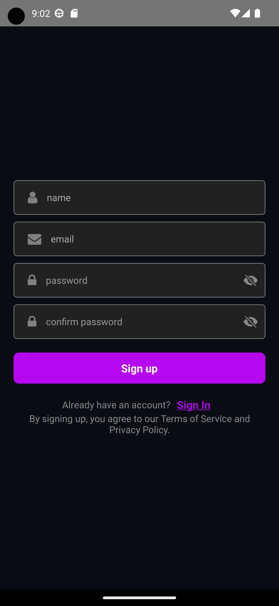
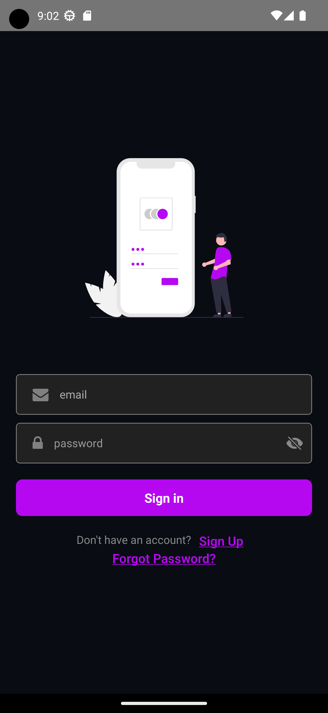
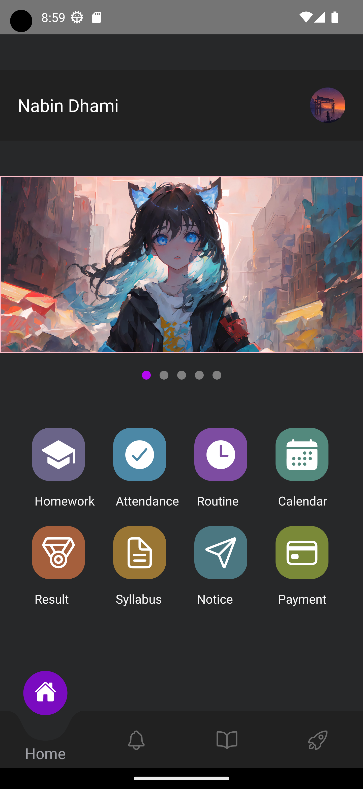
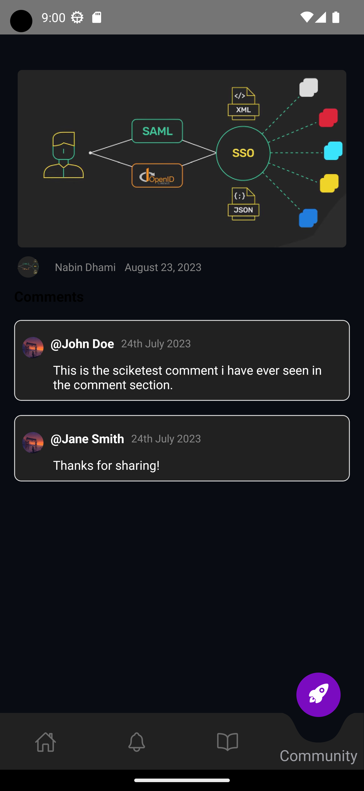
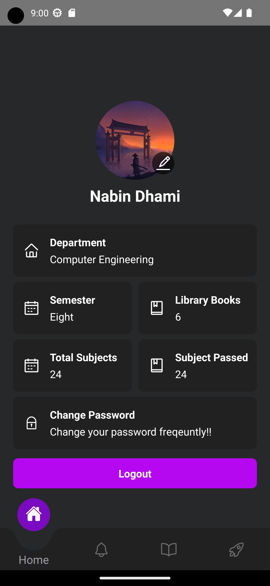
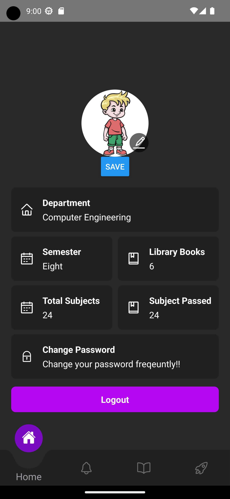
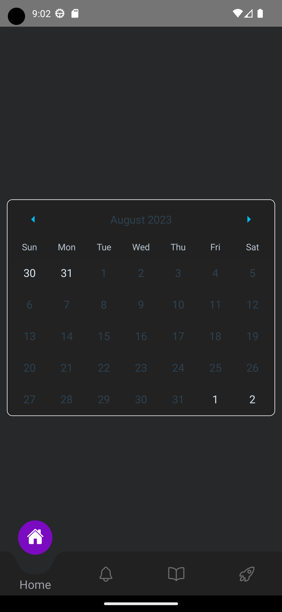

# Hamro College Mobile Application || React Native

## Fetures

- Authentication
- Image Upload
- Syllabus
- Notices
- Routines
- Community
- Calendar
- Library

## Technologies

- React Native
- React Navigation
- React Hook Forms and ZOD
- React Native Image Picker
- Axios and Axios Interceptors

## colors

```css
background-color: '#272829';
```

<div style="display: grid; grid-template-columns: repeat(auto-fill, minmax(150px, 1fr)); gap: 10px; justify-items: center;">
    <div style="text-align: center;">
        
        <p>Screenshot 1</p>
    </div>
    <div style="text-align: center;">
        
        <p>Screenshot 2</p>
    </div>
    <div style="text-align: center;">
        
        <p>Screenshot 3</p>
    </div>
    <div style="text-align: center;">
        
        <p>Screenshot 4</p>
    </div>
    <div style="text-align: center;">
        
        <p>Screenshot 5</p>
    </div>
    <div style="text-align: center;">
        
        <p>Screenshot 6</p>
    </div>
    <div style="text-align: center;">
        
        <p>Screenshot 7</p>
    </div>
    <div style="text-align: center;">
        
        <p>Screenshot 8</p>
    </div>
    <div style="text-align: center;">
        
        <p>Screenshot 9</p>
    </div>
    <div style="text-align: center;">
        
        <p>Screenshot 10</p>
    </div>
    <div style="text-align: center;">
        
        <p>Screenshot 11</p>
    </div>
    <div style="text-align: center;">
        
        <p>Screenshot 13</p>
    </div>
</div>

> [Vector Icons](https://oblador.github.io/react-native-vector-icons/) |
> [React Native Tab View](https://reactnavigation.org/docs/tab-view)
